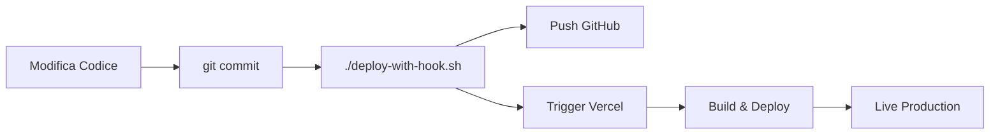

# 🏡 Configuratore Casette Legno - Martello1930 V2

**Versione 2 con Deploy Automatico** 🚀

Sistema di configurazione online per casette in legno da giardino, carport, pergole e strutture su misura.

---

## ✨ Novità Versione 2

- ✅ **Deploy Hook Vercel configurato** per deploy automatici
- ✅ **Script `deploy-with-hook.sh`** per push + deploy in un comando
- ✅ **Badge visivi** sulla homepage per verifica deploy
- ✅ **Workflow automatizzato** GitHub → Vercel
- ✅ **Documentazione completa** setup e deployment

---

## 🚀 Deploy Automatico

Questo progetto utilizza un **Deploy Hook Vercel** per automatizzare i deployment.

### Quick Deploy

```bash
# Fai modifiche al codice
git add .
git commit -m "feat: nuova funzionalità"

# Deploy automatico (push + trigger Vercel)
./deploy-with-hook.sh
```

Lo script:
1. ✅ Pusha su GitHub
2. ✅ Triggera automaticamente deploy su Vercel tramite webhook
3. ✅ Mostra Job ID del deployment

---

## 🎯 Funzionalità

### 👥 Lato Cliente
- ✅ Homepage con logo Martello1930
- ✅ Catalogo 9 modelli (Carport, Casette, Winter House, Eden)
- ✅ Filtri per categoria e materiale
- ✅ Configuratore interattivo su misura
- ✅ Calcolo prezzo stimato in tempo reale
- ✅ Form preventivo con validazione
- ✅ Footer con contatti aziendali

### 🔐 Lato Admin
- ✅ Login con Supabase Auth
- ✅ Dashboard amministrazione
- ✅ CRUD modelli standard
- ✅ Visualizzazione richieste clienti
- ✅ Upload immagini su Supabase Storage
- ✅ Gestione stato richieste

---

## 🛠 Stack Tecnologico

- **Framework**: Next.js 14 (App Router)
- **Styling**: TailwindCSS 3.4
- **Backend**: Supabase (PostgreSQL + Auth + Storage)
- **Form**: React Hook Form + Yup validation
- **PDF**: PDFMake
- **Icons**: Lucide React
- **Deploy**: Vercel con Deploy Hook

---

## 📋 Setup Locale

### 1. Clone Repository

```bash
git clone https://github.com/lucamartello73/configuratorebungalow-v2.git
cd configuratorebungalow-v2
```

### 2. Installa Dipendenze

```bash
npm install
```

### 3. Configura Environment Variables

Crea file `.env.local`:

```env
NEXT_PUBLIC_SUPABASE_URL=https://cebmwjipqqgnzwrvijlu.supabase.co
NEXT_PUBLIC_SUPABASE_ANON_KEY=your_anon_key_here
SUPABASE_SERVICE_ROLE_KEY=your_service_role_key_here
```

### 4. Avvia Dev Server

```bash
npm run dev
```

Apri http://localhost:3000

---

## 🚀 Deploy su Vercel

### Opzione A: Import da GitHub (Consigliato)

1. Vai su https://vercel.com/new/import
2. Importa repository: `lucamartello73/configuratorebungalow-v2`
3. Configura variabili d'ambiente:
   - `NEXT_PUBLIC_SUPABASE_URL`
   - `NEXT_PUBLIC_SUPABASE_ANON_KEY`
   - `SUPABASE_SERVICE_ROLE_KEY`
4. Deploy!

### Opzione B: Deploy Hook (Automatico)

Dopo aver importato il progetto su Vercel:

1. **Vercel Dashboard** → Settings → Git → Deploy Hooks
2. Crea nuovo hook:
   - Nome: "GitHub Deploy"
   - Branch: main
3. Copia URL generato
4. Sostituisci URL in `deploy-with-hook.sh`
5. Usa `./deploy-with-hook.sh` per deploy automatici

---

## 📁 Struttura Progetto

```
configuratorebungalow-v2/
├── app/
│   ├── page.tsx              # Homepage con badge deploy
│   ├── catalogo/             # Catalogo 9 modelli
│   ├── configura/            # Configuratore custom
│   ├── admin/                # Pannello admin
│   └── layout.tsx            # Layout globale
│
├── components/
│   ├── CasettaCard.tsx       # Card prodotto
│   └── layout/               # Header + Footer
│
├── lib/
│   └── supabase.ts           # Client Supabase
│
├── deploy-with-hook.sh       # Script deploy automatico ⭐
├── package.json
├── next.config.js
└── tailwind.config.ts
```

---

## 🗄️ Database Supabase

### Schema Tabelle

```sql
-- Tabella modelli standard
CREATE TABLE modelli_standard (
  id UUID PRIMARY KEY DEFAULT uuid_generate_v4(),
  nome VARCHAR(255) NOT NULL,
  materiale VARCHAR(100),
  descrizione TEXT,
  dimensioni VARCHAR(100),
  prezzo NUMERIC(10,2),
  immagine_url TEXT,
  creato_il TIMESTAMP DEFAULT NOW()
);

-- Tabella configurazioni custom
CREATE TABLE configurazioni_custom (
  id UUID PRIMARY KEY DEFAULT uuid_generate_v4(),
  larghezza NUMERIC(10,2),
  profondita NUMERIC(10,2),
  materiale VARCHAR(100),
  accessori TEXT[],
  prezzo_stimato NUMERIC(10,2),
  cliente_nome VARCHAR(255),
  telefono VARCHAR(50),
  email VARCHAR(255),
  zona VARCHAR(100),
  stato VARCHAR(50) DEFAULT 'nuova',
  creato_il TIMESTAMP DEFAULT NOW()
);
```

### Row Level Security (RLS)

- ✅ Lettura pubblica modelli
- ✅ Inserimento pubblico configurazioni
- ✅ Admin completo con autenticazione

---

## 🔧 Configurazione Deploy Hook

Il file `deploy-with-hook.sh` contiene il workflow automatico:

```bash
#!/bin/bash
# 1. Push su GitHub
git push origin main

# 2. Triggera Deploy Hook Vercel
curl -X POST "https://api.vercel.com/v1/integrations/deploy/YOUR_HOOK_URL"
```

**Personalizza**: Sostituisci `YOUR_HOOK_URL` con il tuo Deploy Hook da Vercel Dashboard.

---

## 🌐 URL Applicazione

Dopo il deploy, l'app sarà disponibile su:

- **Production**: `https://configuratorebungalow-v2.vercel.app`
- **Catalogo**: `/catalogo`
- **Configuratore**: `/configura`
- **Admin**: `/admin/login`

---

## 📊 Workflow Deployment



---

## 🆘 Troubleshooting

### Deploy Hook non funziona?

1. Verifica URL Deploy Hook in `deploy-with-hook.sh`
2. Controlla che il webhook sia attivo su Vercel
3. Verifica log Vercel Dashboard → Deployments

### Build fallisce?

1. Verifica variabili d'ambiente su Vercel
2. Controlla che Supabase URL sia corretto
3. Verifica log di build per errori specifici

### Immagini non visibili?

1. Controlla `next.config.js` domini immagini
2. Verifica che URL immagini siano accessibili
3. Controlla permessi Supabase Storage

---

## 📞 Contatti

**Azienda**: Martello1930 (dal 1930)  
**Sede**: Via Aurelia, Sestri Levante (GE)  
**Tel**: +39 0185 167 656  
**WhatsApp**: https://wa.me/390185167656  
**Email**: soluzioni@martello1930.net  
**Web**: https://www.martello1930.net

---

## 📄 Licenza

© 2025 Martello1930. Tutti i diritti riservati.

---

## 🔗 Repository

**GitHub**: https://github.com/lucamartello73/configuratorebungalow-v2  
**Vercel**: https://vercel.com/dashboard

---

**Versione**: 2.0.0  
**Ultimo aggiornamento**: 2025-11-16  
**Status**: ✅ Production Ready

---

**🧪 Test Deploy Automatico**: 2025-11-16 12:24:24
